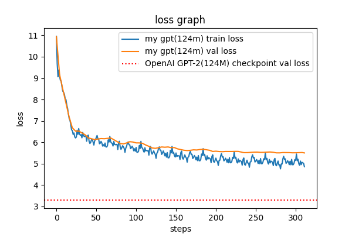

# Reimplement Neural Networks: Zero to Hero
   
Reimplement from scratch "Neural Networks: Zero to Hero" Andrej Karpathy's course.  
This course is an introduction to neural networks from the basics to modern architectures such as the GPT in code.  
Links to the original course: [GitHub](https://github.com/karpathy/nn-zero-to-hero), [YouTube](https://www.youtube.com/playlist?list=PLAqhIrjkxbuWI23v9cThsA9GvCAUhRvKZ), [Site](https://karpathy.ai/zero-to-hero.html).
### Course completion process
1. Watch youtube video lecture and write notebook code in parallel.
2. Close all hints and video and notebook code.
3. Reimplement all code from scratch all alone.

## How it works
There are only 4 folders that matter in the project:
- **`data`** &mdash; 2 tiny datasets that are used in the repo.
- **`lectures`** &mdash; source code for all lectures.
- **`lectures/utils`** &mdash; reusable source code across files.
- **`logs`** &mdash; images of graphs that were created as a result of source code in the lectures folder.
### Source code
**`.py`** files in lectures and lectures/utils folders:
- **`preprocess_names`** — reusable prepare data for 1-5 lectures to feed into neural network.
- **`savefig`** — reusable save png image of graphs for all lectures.
- **`0_autograd`** — backpropogation autograd engine and train mlp at scalar level.
- **`1_bigram`** — bigram character level laguage model with 1 linear layer.
- **`2_mlp`** — n-gram character level mlp laguage model.
- **`3_batchnorm_and_statistics`** — statistics graphs of model and batch normalization layer.
- **`4_backpropogation`** — manual derive backpropagation of tensor-level gradients.
- **`5_cnn_1d`** — wavenet architecture as 1 dimensional cnn for text.
- **`6_gpt_base`** — transformer and gpt architecture pretraining stage without finetuning.
- **`7_tokenizer`** — bpe(byte pair encoding) algorithm for training and inference tokenizer.
- **`8_gpt2_base`** — OpenAI gpt2(124m parameters) architecture efficient ddp pretraining stage without finetuning.
